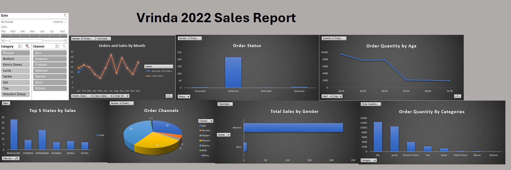

# Nicholasbabs.github.io

# Project 1

**Title**: [Office Supplies and Equipment Company Sales Trends](https://github.com/NicholasBabs/Nicholasbabs.github.io/blob/main/Office%20Equipment%20Analysis.xlsx)

**Tools Used**: Microsoft Excel, Pivot Tables, Slicers.

**Project Description**: This project involved analysing product data of an Office Supplies and Equipment Company to identify trends and patterns in sales performance between 2014-2017. It is designed to provide a comprehensive overview of key performance metrics. This dashboard allows stakeholders to easily monitor and analyze the company’s performance across different states, products, and time periods. The dashboard includes the following features:

Sales by States and Regions: Visual representation of sales broken down by top 10 states and regions.

Total Orders  per Month: A monthly breakdown of orders, providing insights into order trends over time.

Profit by Month: Displays the monthly profit, allowing for easy comparison of profitability throughout the year.

Total Sales and Profit by Categories: This report highlights the total revenue generated in each country and showcases the performance in different markets.

Additionally, the dashboard includes interactive slicers and timeline for:

Year: Filter the data to view performance for a specific year or range of months in a year.

Categories: Focus on categories to analyze performance.

Sub-Categories: Drill down into the performance of individual  products.

**Key findings**:
Regional Profitability: Identified the most profitable states, including California and New York and highlighted states where performance could be improved, like Texas.

Seasonal Trends: Revealed patterns in sales and profit that correspond with seasonal events, allowing for more strategic planning.

Top-Performing Products: Highlighted the products such as phones and chairs that are driving the most revenue and profit, aiding in inventory and marketing decisions.

Sales Volatility: Analyzed monthly sales fluctuations to understand market dynamics and adjust business strategies accordingly.

This dashboard is a crucial tool for the company’s management team, providing clear, actionable insights that drive informed decision-making and strategic planning.

**Dashboard Overview**:

# Project 2

**Title**: [Vrinda Sales Report 2022](https://github.com/NicholasBabs/Nicholasbabs.github.io/blob/main/Office%20Equipment%20Analysis.xlsx)

**Tools Used**: Microsoft Excel, Pivot Tables, Slicers.

**Project Description**:
 This project involved analyzing sales data for Vrinda to uncover key trends and performance metrics in 2022. The dashboard provides stakeholders with an interactive and comprehensive view of sales performance across various dimensions, enabling strategic decision-making. The Dashboard includes the following features:
 
Sales by States and Cities: A bar chart displays the top-performing states, allowing users to quickly identify key regions driving sales.

Order Channels: A pie chart visualizes the share of sales across different channels (e.g., Amazon, Flipkart), helping assess the effectiveness of distribution platforms.

Orders and Sales by Month: A line chart tracks the number of orders and total sales every month, offering insights into seasonal trends.

Order Quantity by Age Group: An age-wise breakdown of order quantities to understand customer demographics and preferences.

Order Quantity by Categories: A bar chart highlights the distribution of order quantities across product categories, identifying best-selling categories.

Order Status: A bar chart that visualizes the status of orders (e.g., delivered, canceled, refunded), providing insights into operational efficiency.

Sales by Gender: A chart showing sales split by gender to understand customer segmentation better.

Additionally, the dashboard includes slicers and filters that enable users to:

Focus on specific categories (e.g., Blouse, Saree).

Drill down into sub-categories for detailed product-level insights.

Use a timeline slicer to analyze performance over specific months.

**Key Findings**:

Sales and order volumes show noticeable fluctuations throughout the year, with peaks in specific months.
There’s a significant drop in sales toward the end of the year, suggesting potential seasonality.

Bengaluru leads in total sales, followed by Chennai and Hyderabad.
These cities contribute the highest revenue, suggesting a strong market presence in these regions.

Ajio and Amazon dominate sales channels, accounting for the largest share of orders.
Flipkart and Myntra also perform well, but platforms like Meesho and Nalli have a smaller contribution.
This highlights the importance of e-commerce channels like Ajio and Amazon for driving sales.

The majority of orders come from customers aged 18-29, making this the key demographic.
Order volumes decline sharply for customers aged 40 and above, indicating a potential gap in appeal for older age groups.

Women account for a significant majority of sales, which highlights the need for marketing efforts focused on female customers.

"Set" and "Kurta" are the top-performing categories, generating the highest order quantities.
Products like "Western Dress" also perform well, while items like "Blouse" and "Bottom" lag behind.

The majority of orders are successfully delivered, indicating operational efficiency.
However, there are smaller shares of canceled and refunded orders that should be monitored to improve customer satisfaction.

Actionable Recommendations:

Focus on High-Performing Regions:

Strengthen marketing and distribution efforts in Bengaluru, Chennai, and Hyderabad.

Target Key Customer Demographics:

Create marketing campaigns and product offerings tailored to customers aged 18-29 and women.

Expand High-Performing Categories:

Increase inventory and promotions for popular categories like "Set" and "Kurta."

Optimize E-commerce Channels:

Strengthen partnerships with Ajio and Amazon while exploring ways to boost sales on smaller channels like Meesho and Nalli.

Address Seasonal Trends:

Identify reasons for sales drops in certain months and implement targeted promotions during low-performing periods.

Reduce Order Issues:

Investigate and resolve causes for canceled and refunded orders to improve customer satisfaction.

**Dashboard Overview**:

# Project 3

**Title:** Sales Record - SQL Data Manipulation and Interrogation

**SQL Code:**[Sales_Record_SQL_Code](https://github.com/NicholasBabs/Nicholasbabs.github.io/blob/main/Sales_Record.sql)

**SQL Skills Used:** Data Retrieval (SELECT): Queried and extracted specific information from the database.
Data Integration:Use of Joins to help integrate data stored across multiple tables to form a cohesive dataset for analysis.
Data Filtering (WHERE, BETWEEN, IN, AND): Applied filters to select relevant data, including filtering by ranges and lists.
Data Source Specification (FROM): Specified the tables used as data sources for retrieval

**Project Description:** This project focuses on analyzing the relationships between salespersons and customers using SQL queries on a hypothetical database containing tables for salespersons, customers, and orders. The goal is to extract meaningful insights about these relationships and transactions.

**Technology used**: SQL server

# Project 4

**Title:** Pizza Data- SQL Data Manipulation and Interrogation

**SQL Code:** [Pizza_Sales_Record_SQL_Code](https://github.com/NicholasBabs/Nicholasbabs.github.io/blob/main/Pizza_sales.sql)

**SQL Skills Used:** Data Retrieval (SELECT): Queried and extracted specific information from the database.
Data Aggregation (SUM, COUNT): Calculated totals, such as sales and quantities, and counted records to analyze data trends.
Data Filtering (WHERE, BETWEEN, IN, AND): Applied filters to select relevant data, including filtering by ranges and lists.
Data Source Specification (FROM): Specified the tables used as data sources for retrieval

**Project Description:** This project involves analyzing pizza sales data stored in a SQL database. The dataset contains detailed information about pizza orders, including order ID, pizza name, category, size, ingredients, price, and order timestamps. The goal is to extract meaningful insights from the data by performing various queries to understand sales performance, customer preferences, and revenue trends.

Use Cases:

Business Decision Support:

Helps in understanding which pizzas, categories, and sizes are most popular.

Provides insights into seasonal trends and high-performing months.

Revenue and Pricing Analysis:

Highlights high-value pizzas and total revenue generated.

Customer Preferences:

Shows preferences for specific pizza categories, like "Veggie" or "The Spinach Supreme."

Inventory and Ingredient Management:
Assists in tracking frequently ordered pizzas for better inventory planning.

**Technology used**: SQL server

